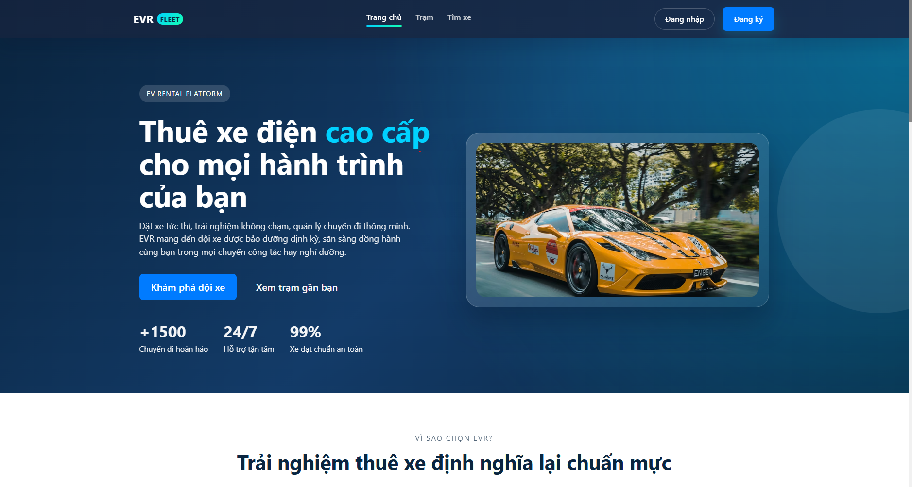
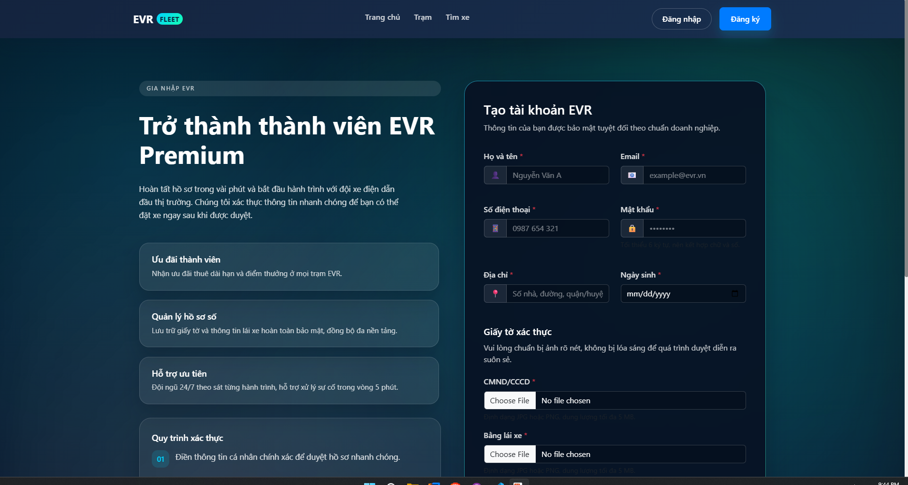
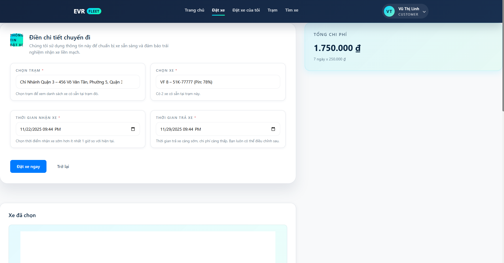

In Vietnam's growing urban landscape, electric vehicles (EVs) promote sustainable transport amid rising pollution and fuel costs. However, EV rentals are often manual, station-based processes leading to inefficiencies. This system digitizes rentals at fixed stations (e.g., in Hanoi/HCMC), allowing renters to book via web, staff to manage handovers, and admins to oversee operations. It targets eco-conscious users, supports government green initiatives, and scales for multiple stations.

